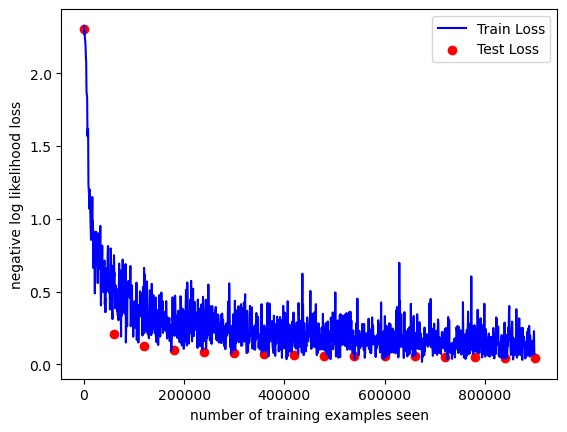
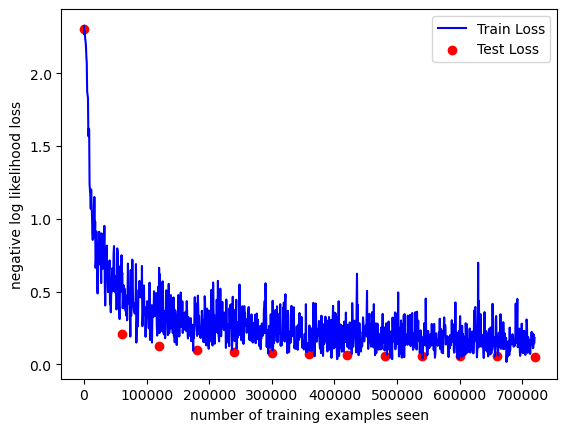
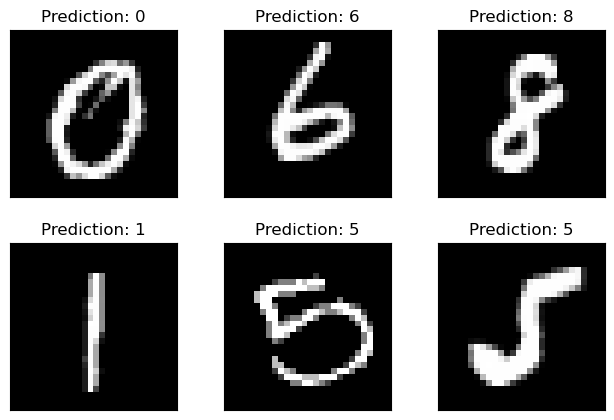

# 手写数字识别实验

## 参考链接

[Reference.](https://nextjournal.com/gkoehler/pytorch-mnist#preparing-the-dataset)

## 主要工具

神经网络搭建与训练： `PyTorch`, `TorchVision.`

可视化展示：`Matplotlib`.

## 主要流程

*更详细流程请参见代码与注释。*

1. 设置超参数；
2. 获得训练和测试数据并划分每批次训练/测试集大小；
3. 搭建神经网络模型并设置优化器；
4. 进行多轮训练；
5. 将训练过程中taining和test loss变化作为图表输出；
6. 进行数字识别并可视化结果。

## 实验结果

经过多次实验得到训练日志与loss图表并对loss图表进行分析（不同epoch的训练结果（包括训练日志、loss图表、样例预测和输出模型）可见文件夹[./epochs](./epochs)，文件夹名表示训练轮数），我认为当训练轮数 `epoch`取12为最佳取值，因为在之后的epoch中loss并没有显著下降。



（上图为epoch=15的loss图表）

以下为epoch设置为12时的结果展示。

### 模型精度

```shell
Test set: Avg. loss: 0.0487, Accuracy: 9853/10000 (99%)
```

epoch=12时，达到了较为理想的99%精度。（截取自训练日志）

### 训练loss变化



### 样例预测结果


